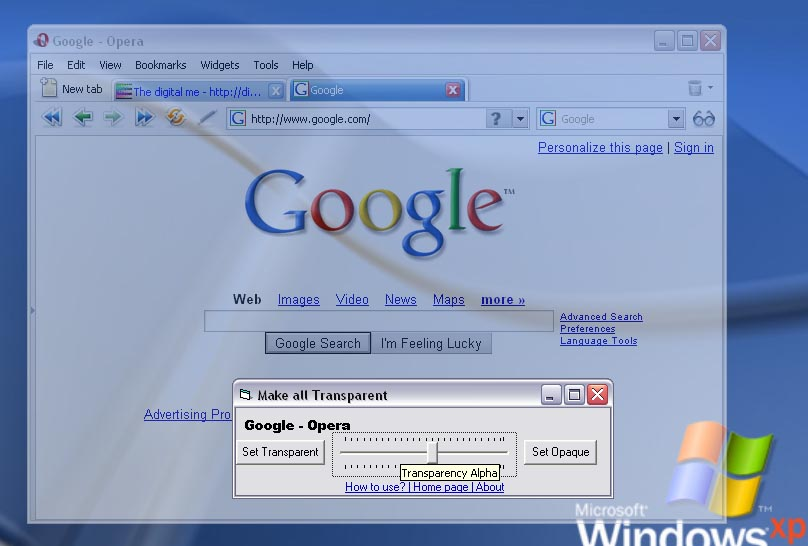



## Make any window Transparent

### Description

This code allows you to make any window on windows XP, transparent ... Cool effect to make the browsers transparent.
 
### More Info
 

             |
---                |---
**Submitted On**   |2007-01-13 04:20:02
**By**             |[Arun P ;\-\)](https://github.com/Planet-Source-Code/PSCIndex/blob/master/ByAuthor/arun-p.md)
**Level**          |Beginner
**User Rating**    |4.8 (29 globes from 6 users)
**Compatibility**  |VB 6\.0
**Category**       |[Graphics](https://github.com/Planet-Source-Code/PSCIndex/blob/master/ByCategory/graphics__1-46.md)
**World**          |[Visual Basic](https://github.com/Planet-Source-Code/PSCIndex/blob/master/ByWorld/visual-basic.md)
**Archive File**   |[Make\_any\_w2042331132007\.zip](https://github.com/Planet-Source-Code/arun-p-make-any-window-transparent__1-67614/archive/master.zip)

